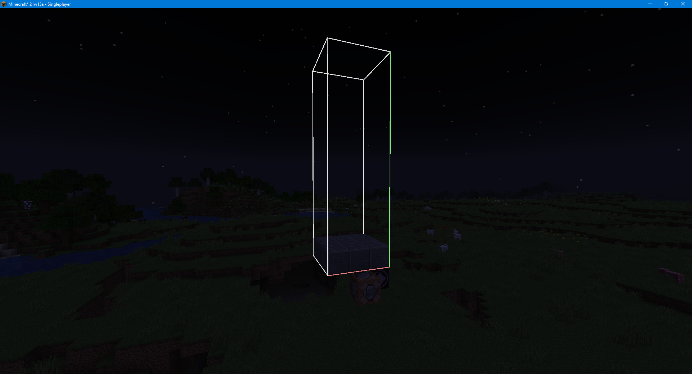
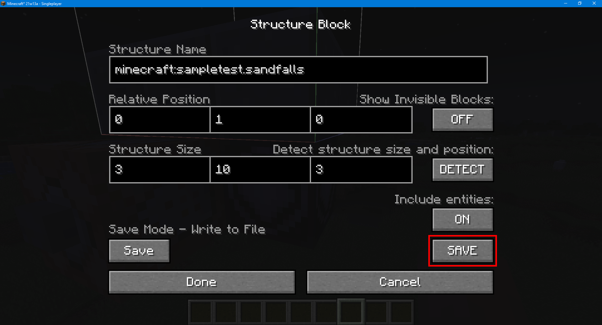
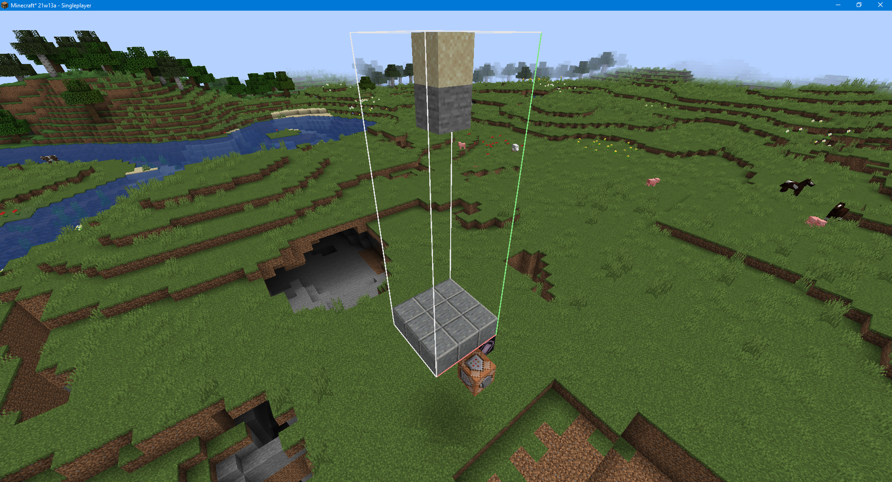
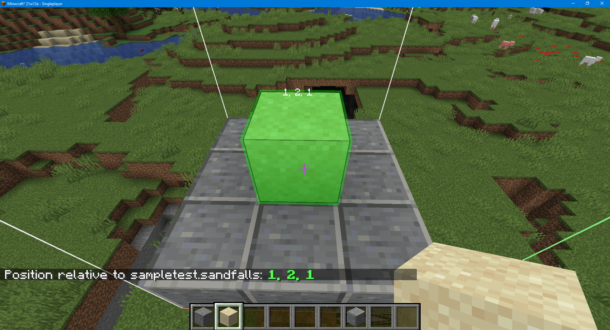

# How to write tests for Mojang's Game Test Framework
Firstly let me start this with a disclaimer,
I've only just started experimenting with this new code, some information
may be incorrect and this is not an exhaustive tutorial.

I've tried my best to provide this in information in multiple mapping, those being:

|Mappings|License|
|--------|-------|
|Yarn    |CC0    |
|MojMap  |https://launcher.mojang.com/v1/objects/be3ba1ca24543ecd73f240c36a3aa61916fa4d0c/client.txt|


## Test Classes
Creating a test class is easy as it's just the same as any other java class.

The name of the test class will in conjunction with the test method to create the test name.
```java
public class SampleTests {
    
}
```
Please open one of the following "spoilers", if you contribute to Yarn please avoid looking at the MojMap names.

<details>
<summary>Yarn</summary>

To register your test class simply call `TestFunctions.method_36068(SampleTests.class);`, replace SampleTests with your class name.

Until Fabric API has a functional test API you will need to set `SharedConstants.isDevelopment` to `true` before running any tests.
</details>

<details>
<summary>MojMap</summary>

To register your test class simply call `GameTestRegistry.register(SampleTests.class);`, replace SampleTests with your class name.

Until Fabric API has a functional test API you will need to set `SharedConstants.IS_RUNNING_IN_IDE` to `true` before running any tests.
</details>


## Test Methods
Please open one of the following "spoilers", if you contribute to Yarn please avoid looking at the MojMap names.
<details>
<summary>Yarn</summary>

Creating a test method is also easy, it just needs to be a `public void` method which sole parameter is a `StartupParameter`

```java
@class_6302
public void sandFallsTest(StartupParameter arg) {

}
```
</details>

<details>
<summary>MojMap</summary>

Creating a test method is also easy, it just needs to be a `public void` method which sole parameter is a `GameTestHelper`

```java
@GameTest
public void sandFallsTest(GameTestHelper helper) {

}
```
</details>

## Test Structures
For this part I recommend you create a stub test method beforehand.

Once in game run the command `/test create [Test Class Name in lowercase].[Test Method Name in lowercase] WIDTH HEIGHT DEPTH`.

For the example gave in previous sections I would run:

`/test create sampletests.sandfallstest 3 10 3`


Next save the structure, use the structure (purple) block and click the `SAVE` button on the right of the screen.

Now you can export your test by running `/test exportthis`.

To run the test, simply click the stone button the command block.

If you are in a different world you can import and run the test by running:

`/test import [Test Class Name in lowercase].[Test Method Name in lowercase]`

`/test run [Test Class Name in lowercase].[Test Method Name in lowercase]`
## Implementing a test
For this section I will continue with my sand falls example. Please see the following structure as it will be important for the test implementation.


To make testing easy minecraft makes all blockpos used whilst testing relative to the structure block.

To easily find the position of the block, look at it and the run `/test pos`.


For this test I would like to remove the stone block stopping the sand from falling, 
wait for the sand to fall, and then finally check if the sand exists in the fallen position.

Please open one of the following "spoilers", if you contribute to Yarn please avoid looking at the MojMap names.
<details>
<summary>Yarn</summary>

```java
@class_6302
public void sandFallsTest(StartupParameter arg) {
    arg.method_36044(new BlockPos(1, 9, 1)); // Break stone block
    arg.method_36003(100, () -> { // After 5 seconds
        arg.method_35972(Blocks.SAND, new BlockPos(1, 2, 1)); // Pass if a Sand block is at 1,2,1 ( which is where it should fall )
    });
}
```
</details>

<details>
<summary>MojMap</summary>

```java
@GameTest
public void sandFallsTest(GameTestHelper helper) {
    helper.destroyBlock(new BlockPos(1, 9, 1)); // Break stone block
    helper.runAfterDelay(100, () -> { // After 5 seconds
        helper.assertBlockPresent(Blocks.SAND, new BlockPos(1, 2, 1)); // Pass if a Sand block is at 1,2,1 ( which is where it should fall )
    });
}
```
</details>